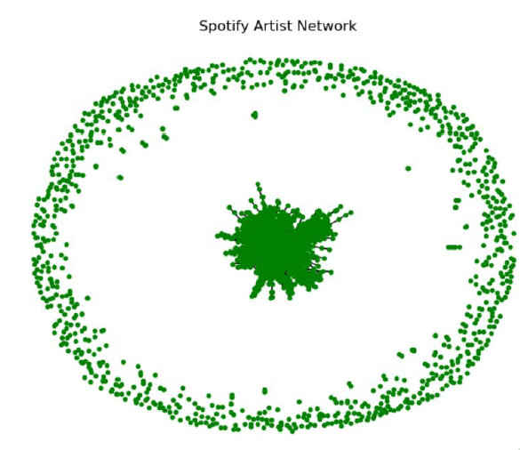
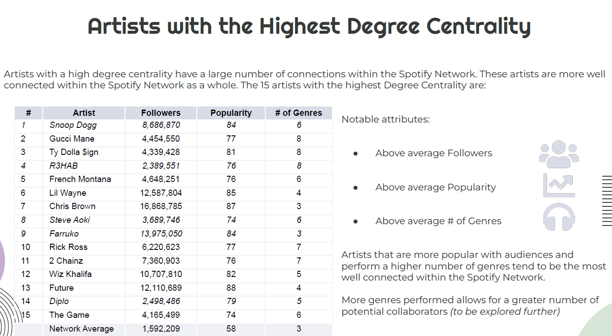
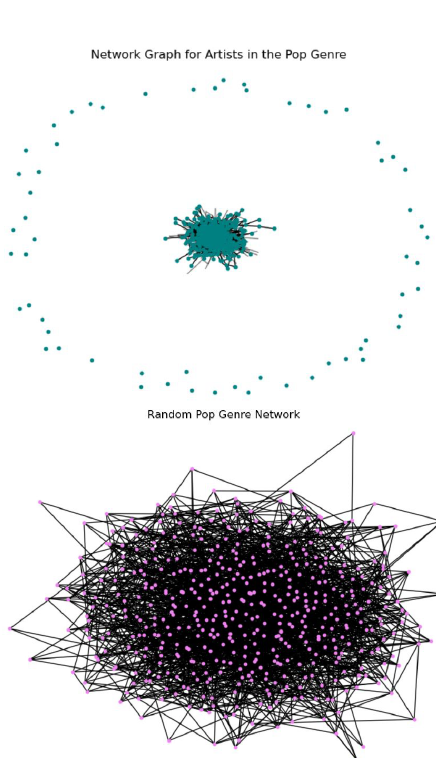

# Spotify-Network-Analytics
# 🎵 Spotify Artist Network Analysis

This project explores the structure of the Spotify artist collaboration network using graph theory. We analyze artist connectedness, genre-specific clustering, centrality metrics, and compare the real network to random graphs.

---

## 📌 Objective

To evaluate how musical artists are connected on Spotify and understand which artists or genres act as central hubs or bridges in the network.

---

## 📊 Dataset

- **Nodes**: 7,286 artists with attributes — name, followers, popularity, genres.
- **Edges**: 37,974 undirected collaboration links between artists.
- Artists with:
  - 0 followers,
  - below-average popularity,
  - or belonging to unpopular genres  
  were filtered out during pre-processing.

---

## 🔍 Network Overview

The Spotify artist network is extremely **sparse**, with a few dense central nodes and a large number of peripheral, less connected artists.

- The dense core represents popular, multi-genre artists who collaborate widely.
- The outer ring contains niche or less popular artists.

---

## 🌐Centrality

Artists with high betweenness centrality serve as **key connectors** across genre and popularity boundaries.

**Insights:**
- Artists like Snoop Dogg, Diplo, and Steve Aoki are among the most connected and influential.
- High centrality is correlated with:
  - Above-average followers,
  - High popularity,
  - Multiple genres.

---

## 🎧 Genre-Specific Networks

Genre subgraphs show tighter clustering and denser connections than the full network, confirming **homophily** — artists prefer collaborating within their genres.

- **Top**: Real Pop genre network — moderately sparse with central communities.
- **Bottom**: Randomly generated network — overly connected and structureless.

---

## 🔬 Key Findings

1. The Spotify network is **sparsely connected**, with low average degree.
2. Popular, multi-genre artists are more central and influential.
3. Collaborations are genre-bound — homophily is strong.
4. Real genre networks are more structured than random equivalents.
5. Pop, Hip-Hop, and Rap show the most cohesive sub-networks.

---

## 📁 Project Contents

- `spotify_artist_network.ipynb`: Full notebook (EDA + network construction)
- `nodes.csv`: Cleaned artist metadata
- `edges.csv`: Collaboration links
- `README.md`: Project overview (this file)
- `*.png`: Project visuals for network layout and centrality

---

## 📌 Conclusion

Spotify’s artist network illustrates how **popularity and genre diversity drive collaboration**. Popular artists act as bridges across genre silos, making them structurally critical. Genre communities are densely connected internally but sparsely linked to others.

